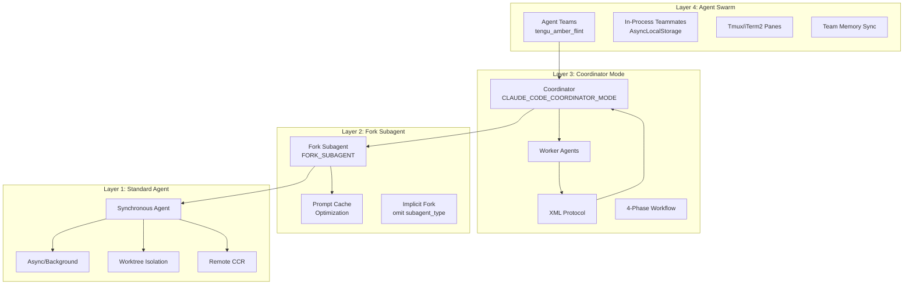
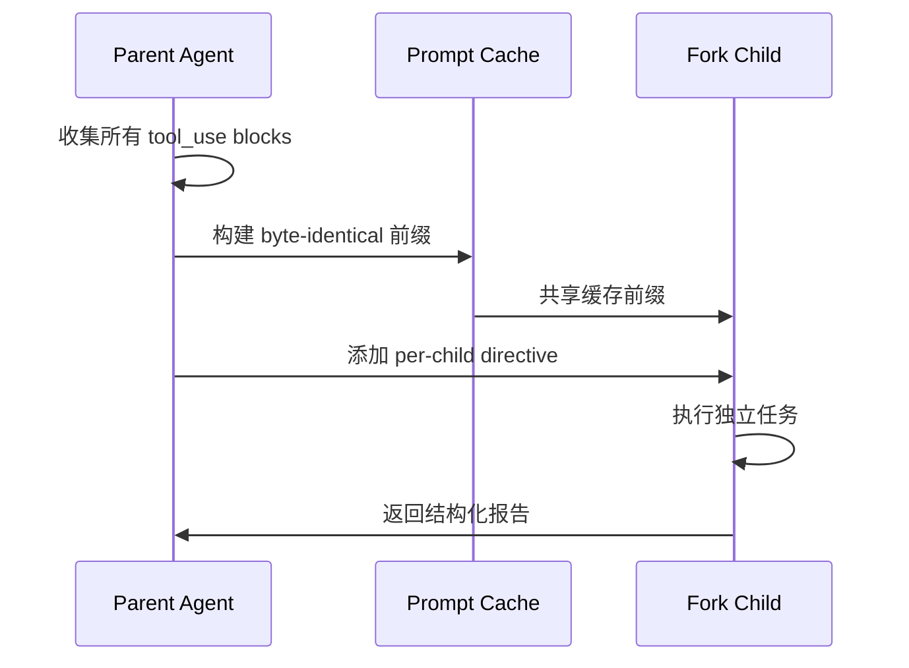
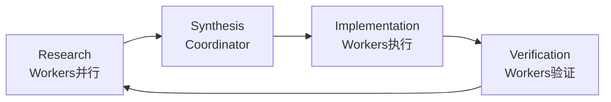
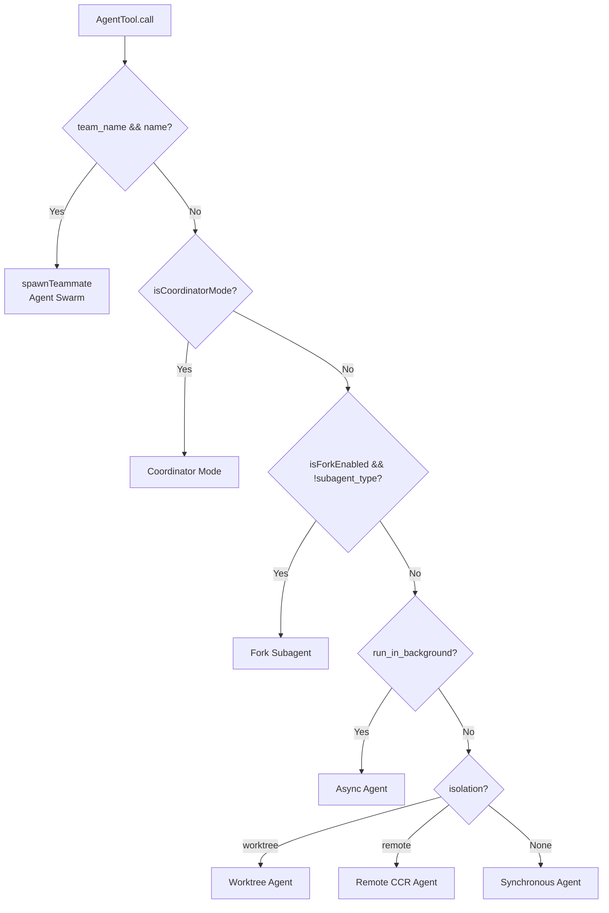
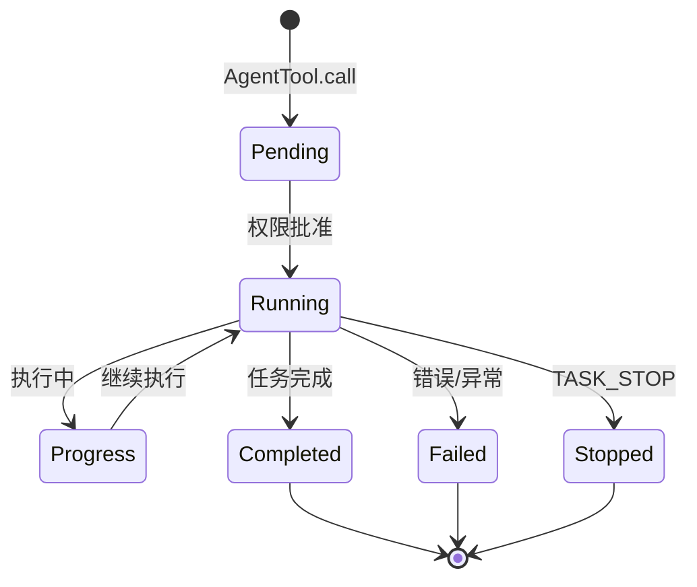

# Claude Code 多 Agent 系统架构

> 来源：Claude Code 泄露源代码分析（2026-03-31）
> 整理时间：2026-04-01

---

## 1. 系统全景图



---

## 2. 四层架构详解

### 2.1 Layer 1: Standard Agent Tool

| 执行模式 | 触发条件 | 隔离级别 | 适用场景 |
|---------|---------|---------|---------|
| **Synchronous** | 默认 | 无 | 简单任务，快速返回 |
| **Async** | `run_in_background: true` | 无 | 长时间运行，不阻塞 |
| **Worktree** | `isolation: "worktree"` | Git worktree | 文件系统隔离 |
| **Remote CCR** | `isolation: "remote"` | Cloud Container | 完全隔离，长时间运行 |

#### 核心文件
- `tools/AgentTool/AgentTool.tsx` (234KB) - 主入口
- `tools/AgentTool/runAgent.ts` - Agent 执行逻辑
- `utils/worktree.ts` - Worktree 隔离实现

---

### 2.2 Layer 2: Fork Subagent

#### 核心创新：Prompt Cache 共享

```typescript
// 所有 fork 子进程共享相同的 API 请求前缀
const FORK_PLACEHOLDER_RESULT = 'Fork started — processing in background'

// 消息序列结构：
// [...history, assistant(all_tool_uses), user(placeholder_results..., directive)]
```

#### Fork 消息构建流程



#### 强制规则（Fork Child）

```
1. IGNORE "default to forking" — you ARE the fork
2. Do NOT converse, ask questions
3. Do NOT editorialize
4. USE tools directly
5. Commit changes with hash
6. Do NOT emit text between tool calls
7. Stay within directive scope
8. Keep report under 500 words
9. Response MUST begin with "Scope:"
10. REPORT structured facts, then stop
```

#### 输出格式规范

```
Scope: <echo back assigned scope>
Result: <key findings>
Key files: <relevant paths>
Files changed: <list with commit hash>
Issues: <only if problems>
```

---

### 2.3 Layer 3: Coordinator Mode

#### 4-Phase 工作流



| 阶段 | 执行者 | 核心任务 |
|------|--------|---------|
| **Research** | Workers (并行) | 调查代码库，理解问题 |
| **Synthesis** | **Coordinator** | 阅读发现，制定实现规格 |
| **Implementation** | Workers | 按规格执行修改 |
| **Verification** | Workers | 独立验证代码正确性 |

#### 通信协议：`<task-notification>` XML

```xml
<task-notification>
  <task-id>agent-a1b</task-id>
  <status>completed|failed|killed</status>
  <summary>Agent "Investigate auth bug" completed</summary>
  <result>Found null pointer in src/auth/validate.ts:42...</result>
  <usage>
    <total_tokens>N</total_tokens>
    <tool_uses>N</tool_uses>
    <duration_ms>N</duration_ms>
  </usage>
</task-notification>
```

#### 关键设计决策

```typescript
// Worker 结果是 user-role 消息，但带有特殊标记
// Coordinator 必须区分：
// - 真正的用户消息
// - Worker 通知（<task-notification>）

// 禁止模式：
"Based on your findings, fix the auth bug"  // ❌ 懒惰委托

// 要求模式：
"Fix the null pointer in src/auth/validate.ts:42. 
 The user field on Session (src/auth/types.ts:15) is undefined 
 when sessions expire but token remains cached. 
 Add a null check before user.id access — if null, 
 return 401 with 'Session expired'. Commit and report hash."  // ✅ 合成规格
```

#### Continue vs Spawn 决策矩阵

| 情况 | 机制 | 原因 |
|------|------|------|
| Research 文件正好是 Implementation 需要的 | **Continue** | 已有上下文 + 清晰计划 |
| Research 宽泛但 Implementation 聚焦 | **Spawn Fresh** | 避免探索噪音 |
| 修正失败 | **Continue** | 保留错误上下文 |
| 验证其他 Worker 的代码 | **Spawn Fresh** | 新鲜视角，无实现偏见 |
| 完全无关的任务 | **Spawn Fresh** | 无有用上下文 |

#### 并行化策略

```
Read-only tasks (research)     → 自由并行
Write-heavy tasks (implementation) → 单文件串行
Verification                   → 可与 Implementation 并行（不同文件区域）
```

---

### 2.4 Layer 4: Agent Swarm / Team Mode

#### 架构组件

```mermaid
flowchart TB
    subgraph "Team Structure"
        LEAD[Team Lead]
        MEMBERS[Team Members<br/>Flat Array]
    end

    subgraph "Communication"
        SEND[SendMessage Tool]
        BROADCAST[to: "*"]
        DIRECT[to: "<name>"]
    end

    subgraph "Isolation Types"
        IP[In-Process<br/>AsyncLocalStorage]
        TMUX1[Tmux Pane<br/>独立进程]
        SPLIT[iTerm2 Split Pane]
    end

    LEAD --> MEMBERS
    MEMBERS --> SEND
    SEND --> BROADCAST
    SEND --> DIRECT
    MEMBERS --> IP
    MEMBERS --> TMUX1
    MEMBERS --> SPLIT
```

#### 关键约束

```typescript
// Teammates 不能 spawn 其他 teammates（扁平结构）
if (isTeammate() && teamName && name) {
  throw new Error('Teammates cannot spawn other teammates')
}

// In-process teammates 不能 spawn background agents
if (isInProcessTeammate() && run_in_background) {
  throw new Error('In-process teammates cannot spawn background agents')
}
```

#### Teammate 系统提示追加

```typescript
const TEAMMATE_SYSTEM_PROMPT_ADDENDUM = `
# Agent Teammate Communication

IMPORTANT: You are running as an agent in a team.
To communicate with anyone on your team:
- Use SendMessage tool with to: "<name>" for specific teammates
- Use SendMessage tool with to: "*" sparingly for broadcasts

Just writing text is NOT visible to others — MUST use SendMessage tool.
The user interacts primarily with the team lead.
`
```

---

## 3. Agent 生命周期管理

### 3.1 调用路由决策树



### 3.2 核心状态流转



---

## 4. 上下文隔离机制对比

| 隔离级别 | 实现技术 | 进程 | 文件系统 | 网络 | UI 可见性 |
|---------|---------|------|---------|------|----------|
| **In-Process** | AsyncLocalStorage | 共享 | 共享 | 共享 | 终端内 |
| **Worktree** | Git worktree | 共享 | 隔离（同仓库） | 共享 | 终端内 |
| **Tmux Pane** | tmux 会话 | 独立 | 共享 | 共享 | 独立 pane |
| **Remote CCR** | Cloud Container | 独立 | 完全隔离 | 独立 | 浏览器 |

---

## 5. 与 OpenClaw Clawteam 对比

| 维度 | Claude Code | OpenClaw Clawteam |
|------|------------|-------------------|
| **架构模式** | 单体应用内多 Agent | Gateway + 分布式 Subagent |
| **协调方式** | Coordinator 集中调度 | 主 Agent 验收 + 监控 |
| **通信协议** | `<task-notification>` XML | 标准工具调用 + 状态查询 |
| **上下文共享** | Prompt Cache 技巧 | 独立进程，显式传递 |
| **隔离级别** | 进程/Worktree/Remote | 独立进程（sandbox） |
| **生命周期** | 内置 async/background | `sessions_spawn` + `subagents` |
| **失败处理** | Continue vs Spawn Fresh | 2次失败升级给主 Agent |
| **特性开关** | 编译时 `feature()` | 运行时配置 |

---

## 6. 核心文件映射

```
claude-code-leaked/
├── coordinator/
│   └── coordinatorMode.ts          # Coordinator 模式核心 (19KB)
├── tools/AgentTool/
│   ├── AgentTool.tsx               # Agent 工具主入口 (234KB)
│   ├── runAgent.ts                 # Agent 执行逻辑 (36KB)
│   ├── forkSubagent.ts             # Fork 子agent实现 (9KB)
│   ├── agentToolUtils.ts           # 工具函数 (23KB)
│   ├── UI.tsx                      # UI 渲染 (125KB)
│   ├── agentMemory.ts              # Agent 内存管理 (6KB)
│   ├── agentMemorySnapshot.ts      # 内存快照 (6KB)
│   ├── builtInAgents.ts            # 内置 Agent 定义 (3KB)
│   └── built-in/
│       └── generalPurposeAgent.ts  # 通用 Agent
├── utils/swarm/
│   └── teammatePromptAddendum.ts   # Teammate 提示追加
├── utils/
│   ├── worktree.ts                 # Worktree 隔离
│   ├── forkedAgent.ts              # Fork agent 上下文
│   └── agentContext.ts             # Agent 上下文管理
└── constants/
    └── prompts.ts                  # 系统提示模板
```

---

## 7. 关键技术决策

### 7.1 为什么用 XML 而不是 JSON？

| 考量 | XML | JSON |
|------|-----|------|
| 人类可读 | ✅ 标签清晰 | ⚠️ 嵌套深 |
| LLM 理解 | ✅ 训练数据多 | ✅ 也不错 |
| 嵌入文本 | ✅ 自然嵌入 | ⚠️ 需要转义 |
| 扩展性 | ✅ 属性灵活 | ⚠️ 结构固定 |

### 7.2 为什么 Continue vs Spawn 这么重要？

```
Continue = 保留完整上下文
- 优点：错误上下文、已加载文件
- 缺点：可能携带无关探索历史

Spawn Fresh = 干净上下文
- 优点：聚焦、无噪音、验证者新鲜视角
- 缺点：需要重新加载文件

决策关键：上下文重叠度
High overlap → Continue
Low overlap  → Spawn Fresh
```

### 7.3 Prompt Cache 优化原理

```
目标：最大化 API 请求的缓存命中率

策略：
1. 所有 fork children 共享相同的 prefix
2. 只有最后一个 text block 不同
3. 使用 byte-exact 的系统提示传递

实现：
- 父 Assistant 消息完整保留（所有 tool_use blocks）
- 子进程 User 消息：placeholder results + directive
- 通过 renderedSystemPrompt 传递，避免重新渲染
```

---

## 8. 可借鉴的设计模式

### 8.1 对 OpenClaw 的启示

| Claude Code 特性 | OpenClaw 对应改进 |
|-----------------|------------------|
| 4-Phase 工作流 | Clawteam 委托策略可明确阶段 |
| `<task-notification>` XML | 标准化 Subagent 返回格式 |
| Continue vs Spawn 决策 | 智能上下文复用 vs 重建 |
| Prompt Cache 优化 | 长会话的上下文压缩策略 |
| Worktree 隔离 | Sandbox 文件系统隔离增强 |
| Agent Swarm | 多 Subagent 并行协调 |

### 8.2 核心原则

```
1. Synthesize, Don't Delegate
   - Coordinator 必须自己理解，不能甩锅给 Worker

2. Parallelism is Your Superpower
   - 能并行就不串行，但要注意写入冲突

3. Context is Expensive
   - 精心设计 Continue vs Spawn 决策
   - 利用 Prompt Cache 减少重复

4. Verification is Independent
   - 验证者必须是 fresh eyes
   - 不能 rubber-stamp

5. Communication is Explicit
   - 必须用 SendMessage，不能靠文本推断
```

---

## 9. 参考链接

- 泄露源代码仓库：https://github.com/kuberwastaken/claude-code
- 详细分析文章：https://kuber.studio/blog/AI/Claude-Code's-Entire-Source-Code-Got-Leaked
- OpenClaw Clawteam 委托策略：`CLAWTEAM_DELEGATION.md`

---

*整理：Yun*  
*时间：2026-04-01*  
*模型：openai-codex/gpt-5.4*